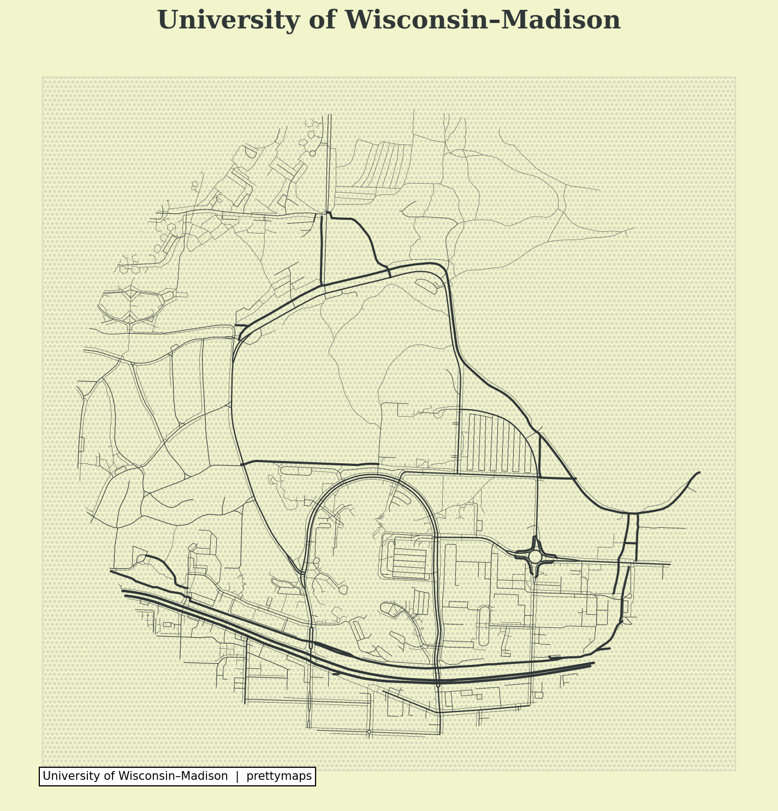

# UW-Madison Pretty Map

A beautiful map of the University of Wisconsin–Madison campus generated using [prettymaps](https://github.com/marceloprates/prettymaps).

## Preview



## How to Run

```bash
# Create conda environment
conda create -n prettymaps python=3.11 -y
conda activate prettymaps

# Install dependencies
pip install prettymaps matplotlib

# Generate map
python generate_map.py
```

## Tools Used

- [prettymaps](https://github.com/marceloprates/prettymaps) — draw pretty maps from OpenStreetMap data
- [osmnx](https://github.com/gboeing/osmnx) — download and model street networks
- [matplotlib](https://matplotlib.org/) — visualization

*On Wisconsin! 🐾*
